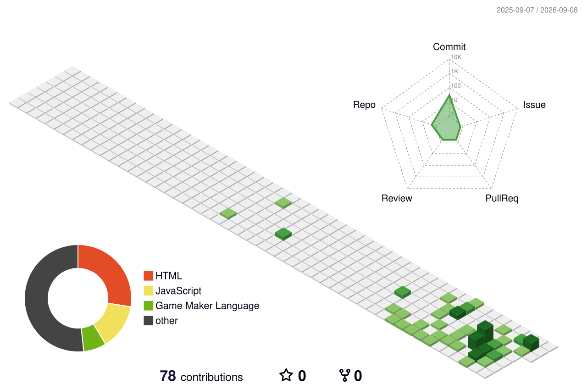

# Hi, I'm Yeri 👋

I'm a developer who enjoys taking on new challenges
and building thoughtful products that genuinely help people.

## Skills
**Currently Working With**

**Tools**

**Also Experienced With**

 

## 🌱 Contributions

---
### Get in Touch

<!--
**yeri-p/yeri-p** is a ✨ _special_ ✨ repository because its `README.md` (this file) appears on your GitHub profile.

Here are some ideas to get you started:

- 🔭 I’m currently working on ...
- 🌱 I’m currently learning ...
- 👯 I’m looking to collaborate on ...
- 🤔 I’m looking for help with ...
- 💬 Ask me about ...
- 📫 How to reach me: ...
- 😄 Pronouns: ...
- ⚡ Fun fact: ...
-->
